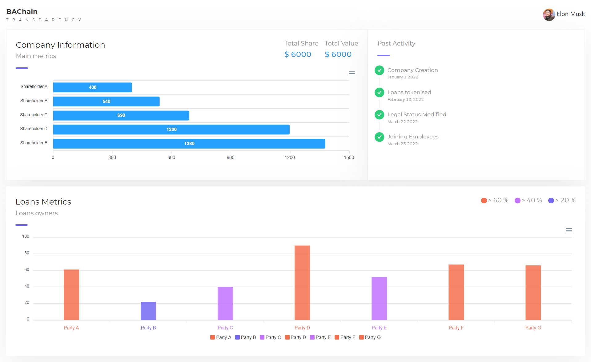

# BAChain Internship Task
This is simple responsive dashboard frontend design . Javascript libraries use in this project are reactjs,ant-design,react-icons,react-apexcharts(for displaying the charts)

## Screenshots
> Output Of The Project

## Live on
I host this application on netlify.com.

> [https://space-x-nextjs-tailwindcss.vercel.app](https://space-x-nextjs-tailwindcss.vercel.app)